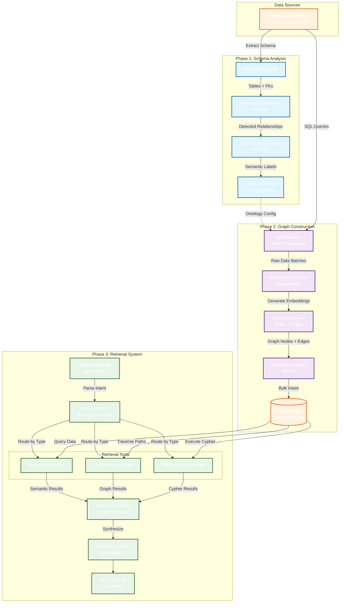

# Relational DB to GraphRAG Transformation System

<div align="center">

**Transform your relational databases into intelligent, semantically-enriched knowledge graphs with AI-powered retrieval**

[](https://www.python.org/downloads/)
[](https://neo4j.com/)
[](https://openai.com/)
[](https://opensource.org/licenses/MIT)

</div>

---

## 📋 Table of Contents

- [Overview](#-overview)
- [System Architecture](#-system-architecture)
- [Key Features](#-key-features)
- [Data Flow Diagram](#-data-flow-diagram)
- [Project Structure](#-project-structure)
- [Installation](#-installation)
- [Quick Start](#-quick-start)
- [Phase Documentation](#-phase-documentation)
- [Usage Examples](#-usage-examples)
- [Configuration](#-configuration)
- [Technologies](#-technologies)
- [Performance](#-performance)
- [Troubleshooting](#-troubleshooting)
- [Contributing](#-contributing)
- [License](#-license)

---

## 🎯 Overview

This is a **production-ready, automated system** that transforms traditional relational databases into semantically-enriched knowledge graphs, enabling advanced AI-powered querying capabilities including:

- **🔍 Semantic Search**: Find entities based on meaning, not just keywords
- **🕸️ Relationship Exploration**: Navigate complex multi-hop connections
- **🤖 Natural Language Queries**: Ask questions in plain English
- **📊 Graph Analytics**: Discover patterns and insights hidden in relationships

### What Problem Does This Solve?

Traditional relational databases excel at structured queries but struggle with:
- Semantic similarity searches ("find customers like X")
- Complex relationship traversals (2+ joins)
- Natural language querying
- Context-aware retrieval

This system bridges that gap by automatically converting your relational data into a **GraphRAG (Graph Retrieval-Augmented Generation)** system.

### Real-World Use Cases

- **Customer Analytics**: "Find customers similar to our top performers"
- **Product Recommendations**: "Show products related to X based on purchase patterns"
- **Supply Chain Analysis**: "What's the path between supplier X and customer Y?"
- **Organizational Intelligence**: "Show the reporting structure and find employees with similar roles"
- **Knowledge Management**: Convert enterprise databases into queryable knowledge graphs

---

## 🏗️ System Architecture

The system operates in **three main phases**, each building upon the previous:

```
┌─────────────────────────────────────────────────────────────────────┐
│                          PHASE 1: ANALYSIS                          │
│                                                                     │
│  Relational DB (PostgreSQL)  →  Schema Analyzer  →  Graph Ontology  │
│         (Northwind)                + LLM                            │
└─────────────────────────────────────────────────────────────────────┘
                                    ↓
┌─────────────────────────────────────────────────────────────────────┐
│                      PHASE 2: TRANSFORMATION                        │
│                                                                     │
│  Graph Ontology  →  ETL Pipeline  →  Knowledge Graph (Neo4j)        │
│                    + Embeddings       • Nodes with vectors          │
│                                       • Relationships               │
└─────────────────────────────────────────────────────────────────────┘
                                    ↓
┌─────────────────────────────────────────────────────────────────────┐
│                        PHASE 3: RETRIEVAL                           │
│                                                                     │
│  Natural Language  →  Agentic System  →  Intelligent Results        │
│      Query            • Vector Search      • Ranked nodes           │
│                       • Graph Traversal    • Relationships          │
│                       • Cypher Generation  • Explanations           │
└─────────────────────────────────────────────────────────────────────┘
```

---

## ✨ Key Features

### 🔄 Automated Schema-to-Ontology Mapping
- **Intelligent Analysis**: Automatically extracts tables, columns, foreign keys
- **Relationship Inference**: Detects implicit relationships from naming patterns
- **LLM-Enhanced**: Uses GPT-4o for semantic labeling and node/edge type generation
- **Junction Table Detection**: Automatically identifies many-to-many relationships

### 🧠 Graph Construction & Enrichment
- **Semantic Embeddings**: Every node enriched with OpenAI embeddings (1536-dim vectors)
- **Batch Processing**: Memory-efficient ETL with configurable batch sizes
- **Entity Resolution**: Automatic deduplication of nodes and relationships
- **Bulk Import**: Optimized Neo4j loading with APOC procedures

### 🤖 Agentic Retrieval System
- **Multi-Modal Search**:
  - **Vector Search**: Semantic similarity using embeddings
  - **Graph Traversal**: Multi-hop relationship exploration
  - **Cypher Generation**: LLM-powered complex query generation
- **Intelligent Planning**: Automatic strategy selection based on query type
- **Natural Language Interface**: No need to learn Cypher or graph query languages
- **Result Explanation**: AI-generated explanations of query results

### 🎛️ Production-Ready Features
- **Docker Compose Setup**: One-command environment setup
- **Configuration Management**: Pydantic-based settings with .env support
- **Error Handling**: Comprehensive error handling and recovery
- **Streaming Support**: Real-time progress updates
- **CLI & Library**: Use as command-line tool or Python library

---

## 📊 Data Flow Diagram



### Flow Explanation

#### Phase 1: Schema Analysis (Blue)
1. **Schema Extraction**: PostgreSQL schema → tables, columns, constraints
2. **Relationship Inference**: Detect naming patterns (e.g., `customer_id` → Customer relationship)
3. **LLM Mapping**: GPT-4o generates semantic node/edge labels
4. **Output**: Graph ontology JSON with 11 node types, 21 edge types

#### Phase 2: Graph Construction (Purple)
1. **Data Extraction**: Batch-read rows from PostgreSQL
2. **Embedding Generation**: OpenAI API creates 1536-dim vectors for each node
3. **Transformation**: Convert rows → graph nodes/edges with properties
4. **Bulk Loading**: Neo4j APOC procedures for optimized insertion
5. **Output**: 1,158 nodes + 5,946 relationships in Neo4j

#### Phase 3: Retrieval System (Green)
1. **Query Planning**: Analyze natural language → select strategy
2. **Tool Execution**:
   - Vector search for "similar to" queries
   - Graph traversal for relationship queries
   - Cypher generation for complex filtering
3. **Orchestration**: Combine multi-tool results
4. **Explanation**: Generate natural language explanations
5. **Output**: Ranked results with context

---

## 📁 Project Structure

```
relational-to-graphrag/
│
├── config/                          # Configuration management
│   ├── __init__.py
│   └── config.py                    # Pydantic settings (PostgreSQL, Neo4j, OpenAI)
│
├── data/                            # Database initialization
│   └── northwind.sql                # Northwind sample database
│
├── output/                          # Phase 1 outputs
│   ├── database_schema.json         # Extracted relational schema
│   ├── graph_ontology.json          # Generated graph ontology
│   └── analysis_summary.txt         # Human-readable summary
│
├── scripts/                         # Executable scripts
│   ├── run_schema_analyzer.py       # Phase 1: Run schema analysis
│   ├── run_graph_builder.py         # Phase 2: Build knowledge graph
│   ├── run_retrieval.py             # Phase 3: Query interface (CLI)
│   ├── test_connections.py          # Test database connectivity
│   └── explore_schema.py            # Interactive schema explorer
│
├── src/                             # Core implementation (4,462 lines)
│   │
│   ├── schema_analyzer/             # PHASE 1: Schema Analysis
│   │   ├── models.py                # Data models (Column, Table, Relationship, etc.)
│   │   ├── analyzer.py              # Main orchestrator
│   │   │
│   │   ├── extractors/
│   │   │   └── postgres_extractor.py    # PostgreSQL schema introspection
│   │   │
│   │   ├── relationship_inference/
│   │   │   └── inference_engine.py      # Implicit relationship detection
│   │   │
│   │   └── ontology_mapper/
│   │       └── llm_mapper.py            # GPT-4o semantic mapping
│   │
│   ├── graph_builder/               # PHASE 2: Graph Construction
│   │   ├── models.py                # Graph data models (GraphNode, GraphEdge)
│   │   ├── builder.py               # Main ETL orchestrator
│   │   ├── extractor.py             # PostgreSQL data extraction
│   │   ├── transformer.py           # Row → Graph transformation
│   │   │
│   │   ├── embeddings/
│   │   │   └── embedding_service.py     # OpenAI embedding generation
│   │   │
│   │   └── loaders/
│   │       └── neo4j_loader.py          # Bulk Neo4j import
│   │
│   └── retrieval_agents/            # PHASE 3: Agentic Retrieval
│       ├── orchestrator.py          # Main agent coordinator
│       ├── query_planner.py         # Strategy selection (Vector/Graph/Cypher/Hybrid)
│       │
│       └── tools/
│           ├── vector_search.py     # Semantic similarity search
│           ├── graph_traversal.py   # Relationship exploration
│           └── cypher_generator.py  # NL → Cypher conversion
│
├── docker-compose.yml               # PostgreSQL + Neo4j containers
├── requirements.txt                 # Python dependencies
├── .env.example                     # Environment variable template
├── .env                             # Your configuration (gitignored)
│
└── Documentation/
    ├── PHASE1_COMPLETE.md           # Phase 1 detailed documentation
    ├── PHASE2_COMPLETE.md           # Phase 2 detailed documentation
    ├── PHASE3_COMPLETE.md           # Phase 3 detailed documentation
    └── SAMPLE_QUERIES.md            # 30+ example queries with expected outputs
```

### Code Statistics

- **Total Lines**: 4,462 lines of Python code
- **Modules**: 33 Python files
- **Node Types Generated**: 11 (from 14 tables)
- **Edge Types Generated**: 21 relationships
- **Nodes in Graph**: 1,158 with embeddings
- **Relationships in Graph**: 5,946

---

## 🚀 Installation

### Prerequisites

- **Python 3.9+**
- **Docker & Docker Compose**
- **OpenAI API Key** ([Get one here](https://platform.openai.com/api-keys))
- **8GB+ RAM** (for embeddings and graph operations)

### Step 1: Clone Repository

```bash
git clone <repository-url>
cd relational-to-graphrag
```

### Step 2: Start Databases

```bash
docker-compose up -d
```

This starts:
- **PostgreSQL** on port `5433` (Northwind database pre-loaded)
- **Neo4j** on ports `7474` (browser) and `7687` (bolt)

Verify with:
```bash
docker-compose ps
```

### Step 3: Create Virtual Environment

```bash
python -m venv venv

# Windows
venv\Scripts\activate

# Linux/Mac
source venv/bin/activate
```

### Step 4: Install Dependencies

```bash
pip install -r requirements.txt
```

### Step 5: Configure Environment

```bash
cp .env.example .env
```

Edit `.env` and add your OpenAI API key:
```env
OPENAI_API_KEY=sk-your-actual-api-key-here
```

### Step 6: Verify Installation

```bash
python scripts/test_connections.py
```

Expected output:
```
✅ PostgreSQL connection successful
✅ Neo4j connection successful
✅ OpenAI API key configured
```

---

## ⚡ Quick Start

### End-to-End Workflow (3 Commands)

```bash
# Step 1: Analyze database schema and generate ontology
python scripts/run_schema_analyzer.py

# Step 2: Build knowledge graph with embeddings
python scripts/run_graph_builder.py

# Step 3: Start querying with natural language
python scripts/run_retrieval.py
```

### Phase 1: Schema Analysis

```bash
python scripts/run_schema_analyzer.py
```

**What it does:**
- Extracts schema from PostgreSQL Northwind database
- Detects relationships (foreign keys + inferred)
- Uses GPT-4o to generate semantic node/edge labels
- Outputs: `output/graph_ontology.json`

**Time:** ~30 seconds
**Cost:** ~$0.05 (OpenAI API)

### Phase 2: Graph Construction

```bash
python scripts/run_graph_builder.py
```

**What it does:**
- Reads ontology from Phase 1
- Extracts all data from PostgreSQL
- Generates embeddings for 1,158 nodes
- Loads graph into Neo4j with relationships

### Phase 3: Interactive Queries

#### Option 1: Command Line Interface (CLI)

```bash
python scripts/run_retrieval.py
```

**Interactive mode:**
```
Query> How many customers are there
📋 Strategy: cypher_query
✅ Found 1 results
customer_count: 91

Query> Find customers similar to ALFKI
📋 Strategy: vector_search
✅ Found 5 similar customers with scores 0.85-0.92

Query> Show all products from category Beverages
📋 Strategy: cypher_query
✅ Found 12 products

Query> explain
💡 The system found 12 products in the Beverages category...
```

#### Option 2: Streamlit Web Interface (Recommended)

```bash
streamlit run streamlit_app.py
```

**Features:**
- 🎨 **Professional UI** - Beautiful, intuitive web interface
- 🔍 **Query Interface** - Natural language input with real-time results
- 📊 **Statistics Dashboard** - Visual charts and database metrics
- 💡 **AI Explanations** - Automatic result explanations
- 📜 **Query History** - Track and review past queries
- ⚙️ **Configuration Panel** - Test connections and view settings
- 📥 **Export Results** - Download results as JSON

**Access at:** http://localhost:8501

See [STREAMLIT_GUIDE.md](STREAMLIT_GUIDE.md) for detailed documentation.

## 📚 Phase Documentation

Each phase has comprehensive documentation:

### [PHASE1_COMPLETE.md](PHASE1_COMPLETE.md)
- Schema analysis architecture
- Relationship inference algorithms
- LLM prompting strategies
- Output format specifications

### [PHASE2_COMPLETE.md](PHASE2_COMPLETE.md)
- ETL pipeline design
- Embedding generation process
- Neo4j optimization strategies
- Troubleshooting guide

### [PHASE3_COMPLETE.md](PHASE3_COMPLETE.md)
- Agent architecture
- Query planning strategies
- Tool descriptions
- Integration guide

### [SAMPLE_QUERIES.md](SAMPLE_QUERIES.md)
- 30+ example queries
- Expected outputs
- Query type explanations
- Parameter tuning guide

---

## 💡 Usage Examples

### Example 1: Semantic Search

**Query:** "Find customers similar to ALFKI"

**How it works:**
1. Query planner detects "similar" keyword → Vector Search
2. Generates embedding for "ALFKI customer context"
3. Searches Neo4j using cosine similarity
4. Returns top-K matches with scores

**Output:**
```json
{
  "strategy": "vector_search",
  "results": [
    {
      "node_id": "ANATR",
      "label": "Customer",
      "score": 0.89,
      "properties": {
        "company_name": "Ana Trujillo Emparedados",
        "country": "Mexico"
      }
    },
    ...
  ]
}
```

### Example 2: Relationship Exploration

**Query:** "Show the reporting structure for employees"

**How it works:**
1. Query planner detects "reporting" → Graph Traversal
2. Finds Employee nodes with REPORTS_TO relationships
3. Traverses hierarchy multi-hop
4. Returns graph structure

**Output:**
```json
{
  "strategy": "graph_traversal",
  "results": {
    "nodes": [...],
    "relationships": [
      {"from": "employee_5", "to": "employee_2", "type": "REPORTS_TO"},
      ...
    ]
  }
}
```

### Example 3: Complex Query

**Query:** "What are the top 5 products ordered by customers from Germany?"

**How it works:**
1. Query planner detects filtering + aggregation → Cypher Generation
2. LLM generates Cypher query:
   ```cypher
   MATCH (c:Customer {country: 'Germany'})-[:PLACED_BY]-(o:Order)-[:CONTAINS]->(p:Product)
   RETURN p.product_name, count(o) as order_count
   ORDER BY order_count DESC
   LIMIT 5
   ```
3. Executes and returns results

### Example 4: Hybrid Query

**Query:** "Find customers similar to ALFKI and show what they ordered"

**How it works:**
1. Query planner detects hybrid strategy
2. Step 1: Vector search for similar customers
3. Step 2: Graph traversal to find their orders
4. Combines results

---

## ⚙️ Configuration

### Environment Variables (.env)

```env
# OpenAI Configuration
OPENAI_API_KEY=sk-...                    # Required: Your API key
OPENAI_MODEL=gpt-4o                      # LLM for reasoning
OPENAI_EMBEDDING_MODEL=text-embedding-3-small  # Embedding model

# PostgreSQL (Source Database)
POSTGRES_HOST=localhost
POSTGRES_PORT=5433                       # Note: 5433 to avoid conflicts
POSTGRES_DB=northwind
POSTGRES_USER=postgres
POSTGRES_PASSWORD=postgres123

# Neo4j (Graph Database)
NEO4J_URI=bolt://localhost:7687
NEO4J_USER=neo4j
NEO4J_PASSWORD=neo4jpassword

# Performance Tuning
BATCH_SIZE=1000                          # ETL batch size
MAX_WORKERS=4                            # Parallel workers
```

### Database Access

**PostgreSQL (Northwind Source Data)**
- **URL**: `localhost:5433`
- **Database**: `northwind`
- **Tables**: 14 (categories, customers, employees, orders, products, etc.)

**Neo4j (Knowledge Graph)**
- **Browser**: http://localhost:7474
- **Username**: `neo4j`
- **Password**: `neo4jpassword`
- **Bolt URL**: `bolt://localhost:7687`

**Useful Neo4j Queries:**
```cypher
// View node counts
MATCH (n) RETURN labels(n) as type, count(*) as count

// View relationship types
MATCH ()-[r]->() RETURN type(r), count(*) ORDER BY count(*) DESC

// Sample nodes with embeddings
MATCH (n:Customer) WHERE n.embedding IS NOT NULL RETURN n LIMIT 5

// Check vector indexes
CALL db.indexes()
```

---

## 🛠️ Technologies

### Core Stack

| Technology | Purpose | Version |
|------------|---------|---------|
| **Python** | Primary language | 3.9+ |
| **PostgreSQL** | Source relational database | 15 |
| **Neo4j** | Graph database backend | 5.15 |
| **OpenAI GPT-4o** | LLM for reasoning & Cypher generation | Latest |
| **OpenAI Embeddings** | Semantic vector generation | text-embedding-3-small |
| **Docker Compose** | Container orchestration | Latest |

### Python Libraries

**Data & Database:**
- `psycopg2-binary` - PostgreSQL driver
- `neo4j` - Neo4j Python driver
- `pandas` - Data manipulation
- `sqlalchemy` - SQL toolkit

**AI & Embeddings:**
- `openai` - OpenAI API client
- `langchain` - LLM framework
- `langgraph` - Agent orchestration
- `sentence-transformers` - Local embeddings (optional)

**Configuration & Utilities:**
- `pydantic` - Settings management
- `python-dotenv` - Environment variables
- `rich` - Terminal formatting
- `click` - CLI framework

### Architecture Patterns

- **ETL Pipeline**: Extract-Transform-Load for data migration
- **Agent Pattern**: Multi-tool orchestration with query planning
- **Repository Pattern**: Database abstraction layers
- **Strategy Pattern**: Query strategy selection
- **Batch Processing**: Memory-efficient data handling


### Scalability

**Current Implementation (Northwind):**
- 14 tables → 1,158 nodes
- ~10,000 rows → 5,946 relationships
- Query response: <5 seconds

**Projected Scalability:**
- ✅ **10K-100K nodes**: Excellent performance with vector indexes
- ⚠️ **100K-1M nodes**: Consider batch embedding generation, may need sharding
- ❌ **1M+ nodes**: Requires distributed Neo4j cluster and optimization

### Optimization Tips

1. **Neo4j Indexes**: Automatically created for node IDs and vector search
2. **Batch Size**: Adjust `BATCH_SIZE` in `.env` (default: 1000)
3. **Embedding Caching**: Embeddings persist in Neo4j, no regeneration needed
4. **Connection Pooling**: Implemented in Neo4j driver
5. **Query Result Limits**: Use `--top-k` parameter to limit results


## 🎓 How It Works: Deep Dive

### Phase 1: Schema Analysis

**Input:** PostgreSQL database with foreign keys
**Output:** Graph ontology JSON

**Process:**
1. **Extraction**: Query `information_schema` for tables, columns, constraints
2. **Inference**: Detect patterns:
   - `customer_id` column → relationship to `customers` table
   - `order_details` table with 2 FKs → junction table (many-to-many)
   - `reports_to` self-referencing FK → hierarchical relationship
3. **LLM Mapping**: Send schema to GPT-4o with prompt:
   ```
   Given these tables and relationships, generate semantic labels:
   - employees.reports_to → REPORTS_TO relationship
   - products.category_id → BELONGS_TO Category
   ```
4. **Validation**: Ensure ontology is valid graph model

**Key Algorithm: Relationship Inference**
```python
def infer_from_naming(column_name: str) -> Optional[Relationship]:
    # Pattern: customer_id → customers table
    if column_name.endswith('_id'):
        target_table = column_name[:-3] + 's'
        return Relationship(source=current_table, target=target_table)
```

### Phase 2: Graph Construction

**Input:** Ontology + PostgreSQL data
**Output:** Neo4j graph with embeddings

**Process:**
1. **Data Extraction**:
   ```sql
   SELECT * FROM customers LIMIT 1000 OFFSET 0;
   -- Batch process 1000 rows at a time
   ```

2. **Embedding Generation**:
   ```python
   text = f"{node_type}: {' '.join(str(v) for v in properties.values())}"
   embedding = openai.embeddings.create(model="text-embedding-3-small", input=text)
   # Returns 1536-dimensional vector
   ```

3. **Transformation**:
   ```python
   GraphNode(
       node_id="ALFKI",
       label="Customer",
       properties={"company_name": "Alfreds Futterkiste", ...},
       embedding=[0.234, -0.123, ...]  # 1536 dimensions
   )
   ```

4. **Bulk Loading** (Neo4j APOC):
   ```cypher
   UNWIND $nodes AS nodeData
   CALL apoc.create.node([nodeData.label], nodeData.properties)
   YIELD node
   RETURN count(node)
   ```

5. **Index Creation**:
   ```cypher
   CREATE INDEX FOR (n:Customer) ON (n.node_id);
   CALL db.index.vector.createNodeIndex(
       'customer_embeddings',
       'Customer',
       'embedding',
       1536,
       'cosine'
   );
   ```

### Phase 3: Retrieval System

**Input:** Natural language query
**Output:** Ranked results + explanation

**Agent Decision Flow:**

```
┌─────────────────────────────────────────────────┐
│ "Find customers similar to ALFKI"               │

└───────────────────┬─────────────────────────────┘
                    │
                    ▼
        ┌───────────────────────┐
        │   Query Planner       │
        │ • Detect "similar"    │
        │ • Extract "ALFKI"     │
        │ • Strategy: VECTOR    │
        └───────────┬───────────┘
                    │
                    ▼
        ┌───────────────────────┐
        │ Orchestrator          │
        │ • Route to Vector Tool│
        └───────────┬───────────┘
                    │
                    ▼
        ┌───────────────────────────────────┐
        │ Vector Search Tool                │
        │ 1. Generate embedding for "ALFKI" │
        │ 2. Cosine similarity search       │
        │ 3. Return top-K (score > 0.7)     │
        └───────────┬───────────────────────┘
                    │
                    ▼
        ┌───────────────────────┐
        │ Result Formatting     │
        │ • Add properties      │
        │ • Calculate scores    │
        └───────────┬───────────┘
                    │
                    ▼
        ┌─────────────────────────────┐
        │ LLM Explanation Generator   │
        │ "Found 5 similar customers  │
        │  based on semantic analysis │
        │  of company profile..."     │
        └─────────────────────────────┘
```

**Vector Search Math:**
```python
# Cosine similarity
def cosine_similarity(vec1, vec2):
    dot_product = sum(a * b for a, b in zip(vec1, vec2))
    magnitude1 = sqrt(sum(a * a for a in vec1))
    magnitude2 = sqrt(sum(b * b for b in vec2))
    return dot_product / (magnitude1 * magnitude2)

# Score: 1.0 = identical, 0.0 = orthogonal, -1.0 = opposite
```

---
